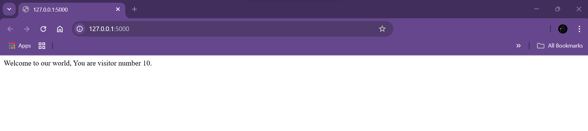

# Flask + Redis Visitor Counter (Dockerized)

This is a simple web application built with **Flask** and **Redis**, fully containerized using **Docker** and orchestrated with **Docker Compose**. The app counts the number of visitors using a Redis-backed counter and displays the result on a webpage.

---

## Tech Stack

- **Flask** – Lightweight Python web framework
- **Redis** – In-memory key-value store used as a counter
- **Docker** – For containerizing the application
- **Docker Compose** – To manage multi-container application

---

## Project Structure

flask-App/

├── app/

│ ├── app.py # Flask app with Redis counter

│ └── requirements.txt # Python dependencies

├── docker-compose.yml # Orchestration file

├── Dockerfile # Image definition for Flask app

└── README.md # This file

---

## Run the App

Clone the repo and navigate into the project folder:

```bash
git clone https://github.com/BaherFlash1102/flask-App.git
cd flask-App
```
Start the app using Docker Compose:

```bash
docker-compose up --build
```
Visit the app at:
👉 http://localhost:5000

## 📸 Example Output


Each time the page is refreshed, the Redis counter increases by one.
